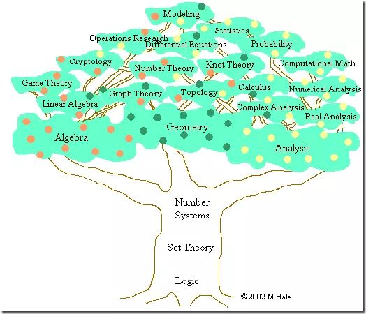

### **集合论**：现代数学的共同基础

现代数学有两大家族：分析(Analysis)和代数(Algebra)

几何与概率论建立在分析或者代数的基础上

## **分析**：在极限基础上建立的宏伟大厦

**微积分：分析的古典时代--从牛顿到柯西**

如果说有一个思想贯穿其中，那就是极限——这是整个分析（不仅仅是微积分）的灵魂。

### 柯西极限思想

直到柯西用极限的观点重新建立了微积分的基本概念，这门学科才开始有了一个比较坚实的基础。直到今天，整个分析的大厦还是建立在极限的基石之上。

### 黎曼积分

我们在现在的微积分课本中学到的那种通过“无限分割区间，取矩阵面积和的极限”的积分，是大约在1850年由黎曼(Riemann)提出的，叫做黎曼积分。但是，什么函数存在黎曼积分呢（黎曼可积）？数学家们很早就证明了，定义在闭区间内的连续函数是黎曼可积的。可是，这样的结果并不令人满意，工程师们需要对分段连续函数的函数积分。

### 不连续函数的可积性问题

对于定义在闭区间上的黎曼积分的研究发现，可积性的关键在于“不连续的点足够少”。

无限处不连续的可积函数呢？是否可求积分呢？

### 测度理论(Measure Theory)与勒贝(Lebesgue Integral)积分

上面说到的实数理论，测度理论和勒贝格积分，构成了我们现在称为实分析 (Real Analysis)的数学分支，有些书也叫实变函数论。

测度理论是现代概率论的基础。

## 代数

### 抽象代数

主要研究的是运算规则。一门代数，其实都是从某种具体的运算体系中抽象出一些基本规则，建立一个公理体系，然后在这基础上进行研究。一个集合再加上一套运算规则，就构成一个代数结构。

在主要的代数结构中，最简单的是群(Group)

阿贝尔群 (Abelian Group)

环(Ring)

可交换环(Commutative Ring)

域(Field)

基于域，我们可以建立一种新的结构，能进行加法和数乘，就构成了线性代数(Linear algebra)。

抽象代数有在一些基础定理的基础上，进一步的研究往往分为两个流派：研究有限的离散代数结构（比如有限群和有限域），这部分内容通常用于数论，编码，和整数方程这些地方；另外一个流派是研究连续的代数结构，通常和拓扑与分析联系在 一起（比如拓扑群，李群）。

### 线性代数

线性代数，包括建立在它基础上的各种学科，最核心的两个概念是向量空间和线性变换。

我们常用的非线性化的方法包括流形和kernelization

**3 泛函分析：从有限维向无限维迈进**

泛函分析(Functional Analysis)是研究的是一般的线性空间，包括有限维和无限维，但是很多东西在有限维下显得很trivial，真正的困难往往在无限维的时候出现。

在泛函分析中，空间中的元素还是叫向量，但是线性变换通常会叫作“算子”(operator)。

## 现在概率论：在现代分析基础上再生

## 参考

[MIT牛人解说数学体系](https://zhuanlan.zhihu.com/p/89819302)

